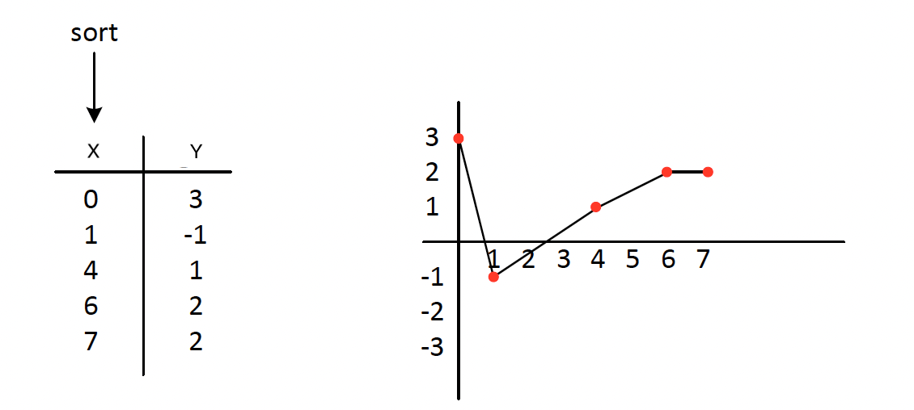
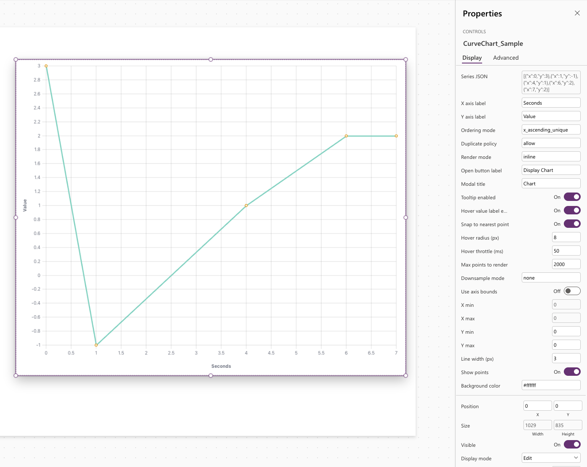
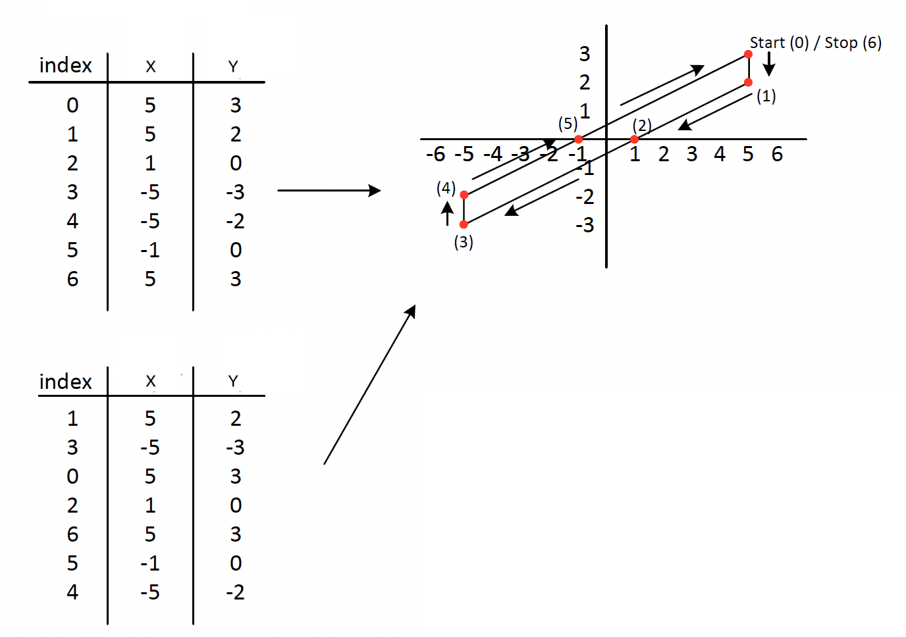
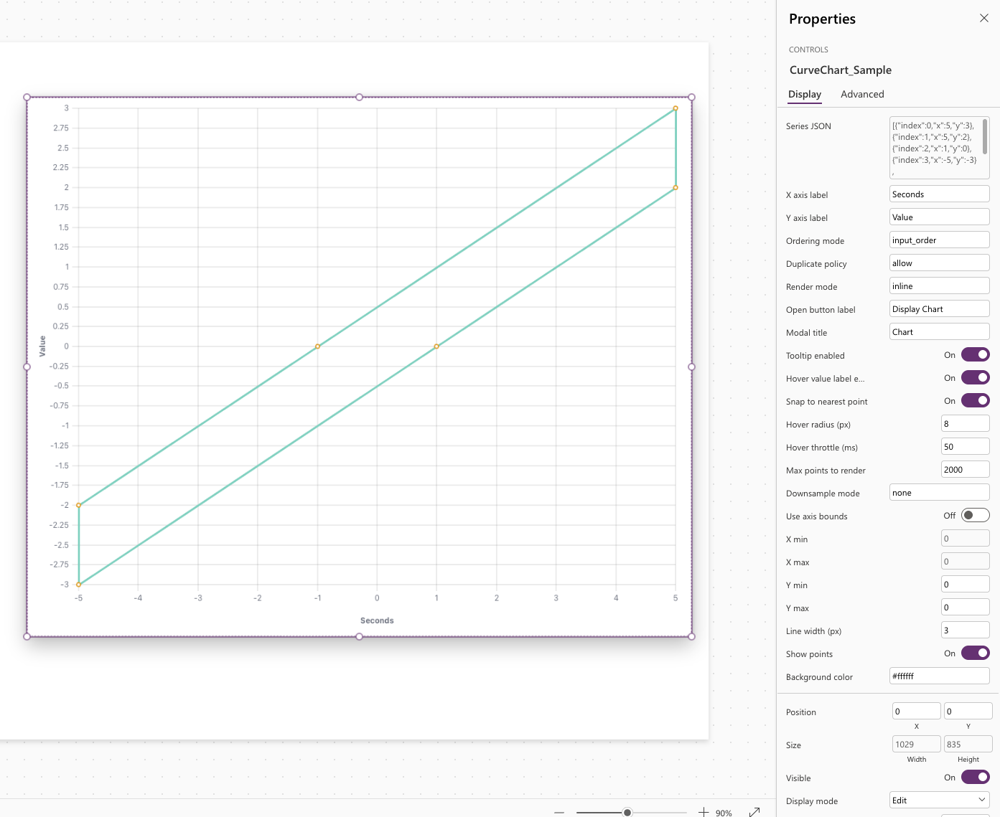

# CurveChart PCF

Power Apps Component Framework (PCF) custom control repository.

CurveChart is a PCF virtual control for Canvas apps that renders interactive XY curve and line charts from JSON, with ordering modes, duplicate policies, and hover and selection outputs.

## Visual preview

### Sorted X mode
Sample input:

PCF rendering:

### Index-driven mode
Sample input:

PCF rendering:

## Creator
- Harllens George de la Cruz - The Boring Cat
- https://theboringcat.com/
- See `docs/creator.md` for attribution and hub context.

## Project structure
- `pcf/`: CurveChart PCF control source, manifest, and frontend dependencies.
- `solution/`: Dataverse solution packaging project.
- `docs/`: Public usage and reference documentation.

## Quickstart
- `cd pcf && npm install && npm run build`
- `cd pcf && npm start` (local test harness)

## CurveChart PCF control
- `pcf/TimeSeriesChart/ControlManifest.Input.xml`
- `pcf/TimeSeriesChart/index.ts`

## Docs
- `docs/chart-control-spec.md`
- `docs/dev-setup.md`
- `docs/canvas-usage.md`
- `docs/creator.md`
- `docs/properties-reference.md`
- `docs/examples.md`

## License
- Apache License 2.0 (`LICENSE`)
